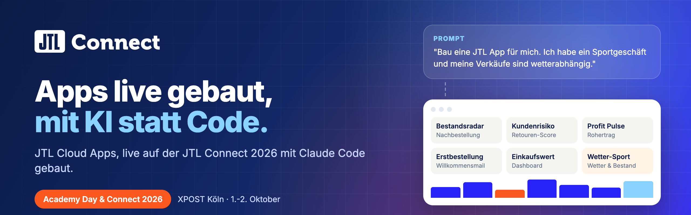
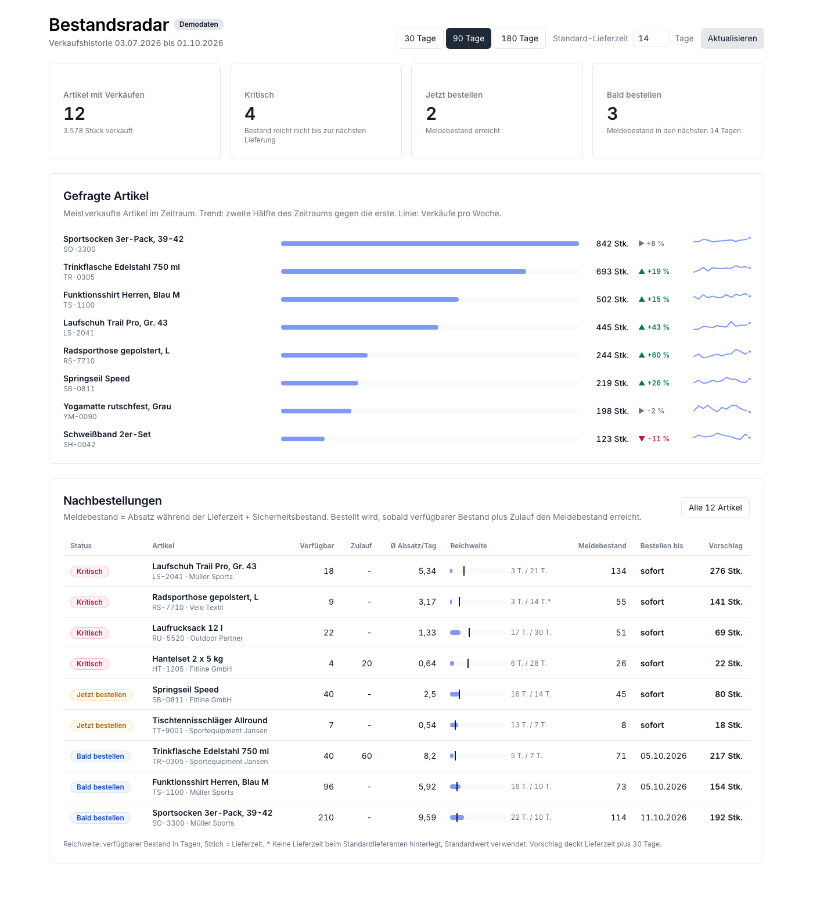
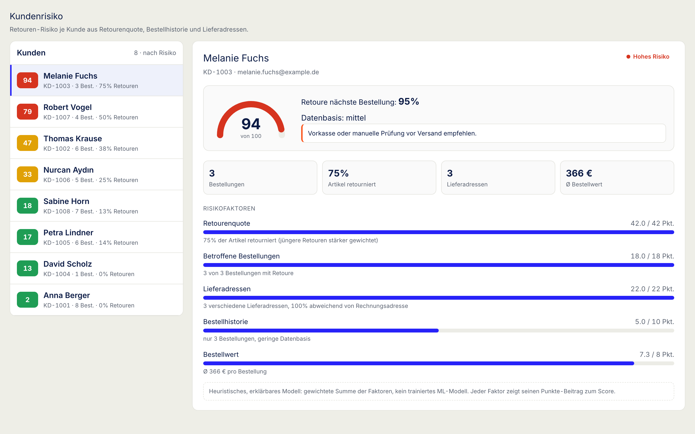

<p align="center">
  
</p>

# Academy Day Examples

JTL Cloud Apps, die auf der [JTL Connect 2026](https://www.jtl-connect.de/) live mit KI gebaut wurden. Jede App liegt in einem eigenen Ordner, mit Quellcode, README, Screenshot und dem Prompt-Verlauf, aus dem sie entstanden ist.

Die JTL Connect ist die Hausmesse von JTL-Software. 2026 fand sie am 1. und 2. Oktober in der XPOST Köln statt: am ersten Tag der Academy Day mit Workshops der JTL-Produktteams, am zweiten Tag die Connect mit Bühnenprogramm und Fachvorträgen.

## Die Sessions

**"Kein Entwickler? Kein Problem! Baut live eure eigene App mit KI"**
90 Minuten am Academy Day (1. Oktober). Das Publikum hat die Ideen geliefert, Claude Code hat daraus live JTL Cloud Apps gebaut, registriert und im ERP gezeigt. Die Prompts kamen direkt aus dem Raum, inklusive Tippfehlern.

**"Die JTL Cloud kann das nicht? Dann bau es dir einfach selbst."**
20 Minuten am Haupttag (2. Oktober). Eine App von der Idee bis zur Ansicht im ERP: ein Sportgeschäft, dessen Verkäufe vom Wetter abhängen.

## Die Apps

| App | Was sie macht | Session | Stack |
| --- | --- | --- | --- |
| [Bestandsradar](bestandsradar/) | Dashboard mit gefragten Artikeln. Berechnet aus der Verkaufshistorie Meldebestand, Reichweite und wann nachbestellt werden sollte. | Academy Day | React + Node |
| [first-order-welcome](first-order-welcome/) | Seitenleiste in der Auftragsansicht. Erkennt die erste Bestellung eines Kunden und baut eine passende Willkommensmail. | Academy Day | React + Node |
| [hand-build-app](hand-build-app/) | Dashboard mit dem tatsächlichen Einkaufswert der verkauften Ware, dazu eine Seitenleiste pro Kunde. | Academy Day | React + Node |
| [Kundenrisiko](kundenrisiko/) | Retouren-Risiko pro Kunde als erklärbarer Score (Retourenquote, Lieferadressen, Bestellhistorie) mit Handlungsempfehlung. | Academy Day | React + .NET |
| [Profit Pulse](profit-pulse/) | Umsatz und Rohertrag nach Lieferant, Kunde und Lieferadresse, mit Monatsverlauf und CSV-Export. | Academy Day | Node |
| [Wetter-Sport](wetter-sport/) | Verkäufe eines Artikels mit dem Wetter am Verkaufstag, dazu Nachbestellvorschläge auf Basis der 7-Tage-Wetterprognose. | Haupttag | React + Node |

<p align="center">
  
  
  
</p>

## Eine App starten

Alle Apps sind JTL Cloud Apps. Die meisten wurden mit dem offiziellen Template [`@jtl-software/create-cloud-app`](https://developer.jtl-software.com/cloud/get-started/quick-start/from-template) angelegt. Die genauen Schritte stehen im README der jeweiligen App, meist reicht:

```bash
cd <app-ordner>
npm install
npm run register   # einmalig: App bei JTL registrieren und Zugangsdaten schreiben
npm run dev
```

Zugangsdaten (`.env`) sind nicht im Repo. `npm run register` legt sie für die eigene Organisation neu an. Die meisten Apps haben außerdem eine Demo-Ansicht mit Beispieldaten, die ohne JTL-Login läuft.

## Selbst ausprobieren

- [JTL Developer Documentation](https://developer.jtl-software.com/): Einstieg, App-Manifest, ERP API
- [Claude Code](https://claude.com/claude-code): das KI-Werkzeug, mit dem die Apps gebaut wurden

Die Apps sind Beispiele aus Live-Demos, keine geprüften Produkte. Sie zeigen, was in kurzer Zeit möglich ist, und eignen sich als Startpunkt für eigene Ideen.
