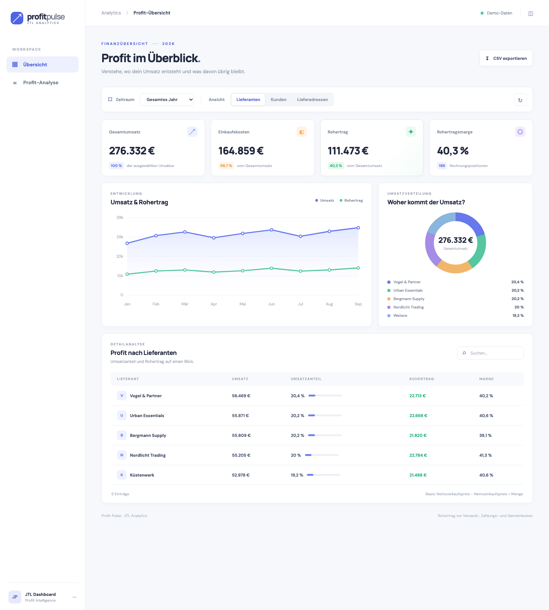

# Profit Pulse · JTL Cloud App

Profit Pulse ist ein Dashboard für JTL Cloud ERP. Es zeigt, wie sich der Gesamtumsatz auf Lieferanten, Kunden und Lieferadressen verteilt und welcher Rohertrag in jeder Gruppe entsteht. Die App ist für die Organisation **Hackmamba** registriert; das [App-Manifest](./app.json) enthält ihre JTL-Einstiegspunkte und Lese-Scopes.

## Funktionen

- Kennzahlen für Umsatz, Einkaufskosten, Rohertrag und Rohertragsmarge
- Monatsverlauf von Umsatz und Rohertrag sowie Verteilung des Umsatzes als Ringdiagramm
- Gruppierung nach Lieferant, Kunde oder Lieferadresse mit Umsatzanteil, Rohertrag und Marge pro Gruppe
- Zeitraumfilter, Suche, Aktualisierung und CSV-Export der ausgewählten Rechnungspositionen
- Demo unter `/` und JTL-Ansicht mit echten Mandantendaten unter `/erp`

## Screenshot



Der Screenshot zeigt **Demodaten**. In JTL Cloud ERP werden nach Installation Daten des verbundenen Mandanten geladen.

## Lokal starten

```sh
npm install
npm start
```

Unter `http://localhost:55050` erscheint eine klar gekennzeichnete Demo. In Conductor verwendet der Server den diesem Workspace zugewiesenen `CONDUCTOR_PORT` (hier 55050); außerhalb davon gilt `PORT` aus `.env`. Nach Registrierung und Installation öffnet JTL Cloud ERP das Dashboard unter `/erp`. Der JTL Hub lädt `/setup` während der Installation. Beide Seiten verwenden die AppBridge für den App-Token; der Server verifiziert dessen Signatur, Aussteller, Ablauf und App-ID. Für API-Aufrufe verwendet er das registrierte Servicekonto und die Mandantenkennung des verifizierten Tokens.

## App registrieren

Die [JTL-Cloud-App-Anleitung](https://developer.jtl-software.com/cloud/get-started/quick-start/from-scratch/connect-and-fetch#2-register-your-app) beschreibt diesen Ablauf:

1. `npm run register` im Projektverzeichnis ausführen. Die JTL-CLI öffnet die Anmeldung mit JTL ID und lässt eine Organisation auswählen. Sie liest `app.json` und schreibt Client-ID, App-ID und Servicekonto-Schlüssel in die gitignorierte `.env`. Besteht die App bereits, bietet die CLI eine Aktualisierung an.
2. Die App im [JTL Hub](https://hub.jtl-cloud.com/) unter **Manage apps → Apps in development** installieren.
3. Während der Einrichtung `/setup` im JTL Hub laden und **Einrichtung abschließen** wählen. Danach **Profit Pulse** im Cloud ERP öffnen.

Die bestehende Registrierung in Hackmamba hat die App-ID `651a78ec-18d5-4fa5-bbd2-4ca0d32dd805`. Die Manifest-URLs zeigen auf `localhost:55050` und sind für diese lokale Entwicklungsinstallation gedacht. Für eine gemeinsam genutzte Installation müssen sie auf eine erreichbare HTTPS-Domain geändert und die App dort betrieben werden.

## Datenbasis

`Umsatz = Menge × Nettoverkaufspreis`, `Einkaufskosten = Menge × Nettoeinkaufspreis`, `Rohertrag = Umsatz − Einkaufskosten`, `Marge = Rohertrag / Umsatz`. Grundlage sind nicht stornierte, nicht als Entwurf markierte Verkaufsrechnungen und deren Positionen. Lieferanten werden über den aktuellen Standardlieferanten des Artikels zugeordnet. Die historische Bezugsquelle kann davon abweichen. Retouren, Rechnungskorrekturen, Versand-, Zahlungs- und Gemeinkosten sowie mögliche zusätzliche Rabatte sind nicht berücksichtigt. Es handelt sich um Rohertrag, nicht um buchhalterischen Nettogewinn. Fremdwährungen werden nicht mit EUR vermischt.

Die App liest `GET /sales-invoices`, `GET /sales-invoices/{id}/line-items` und `GET /items/{id}/suppliers` aus der [JTL ERP API v2](https://developer.jtl-software.com/openapi/erp/2.0.json). Der Server speichert Live-Daten je Mandant fünf Minuten zwischen. Zugangsdaten und `.data/` sind gitignoriert.

## Projektverlauf

Die bisherigen Nutzer-Prompts und kurze, nicht sensible Antwortzusammenfassungen stehen in [PROMPT_HISTORY.md](./PROMPT_HISTORY.md). Zugangsdaten sind darin nicht enthalten.
