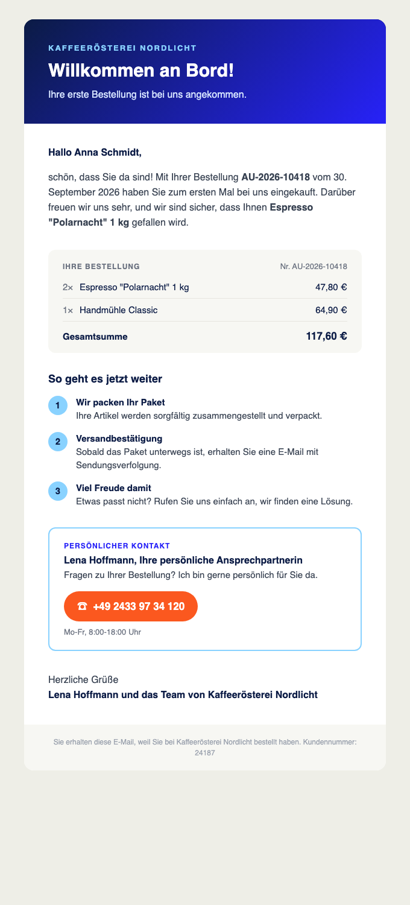

# first-order-welcome

A JTL Cloud App for JTL-Wawi/ERP. It adds a side panel to the sales order overview (Verkauf > Aufträge). When you select an order, the panel shows whether it is the customer's first order. For a first order, it builds a welcome email that refers to that order.



_The welcome email, rendered with sample data._

## What the panel shows

| Selected order | Panel content |
|---|---|
| First order of the customer | Banner "... bestellt zum ersten Mal!" with order number, date and total, plus the welcome email with a live preview |
| Customer has ordered before | "Wiederkehrender Kunde", the number of orders and the customer's first order |
| Guest order without a customer account | Note that the first order cannot be determined |

The email actions in the panel:

- **Mail kopieren** copies the email as HTML (with a plain-text fallback), ready to paste into a mail client.
- **Im Mailprogramm** opens a new mail to the customer's billing address with subject and plain-text body.

## The welcome email

- Greets the customer by name and names the order number, the order date and the first item.
- Lists the ordered items with the total.
- Explains the next steps (packing, shipping confirmation, delivery).
- Contains a personal contact with a clickable phone number. The contact is made up: Lena Hoffmann, +49 2433 97 34 120. Change it in `SUPPORT_CONTACT` in `packages/frontend/src/common/welcomeEmail.ts`.
- Uses the company name of the order as the shop name. The email addresses the customer with "Sie".

## How it works

- `app.json` declares one ERP pane with `"context": "salesorders"`. The ERP shows it on the sales order overview and the order detail page.
- The panel (`packages/frontend/src/pages/first-order-pane/`) listens to the App Bridge event `SalesOrderChanged` and calls `getCurrentSalesOrderId` on load.
- `packages/frontend/src/common/firstOrder.ts` calls the ERP GraphQL API (`/erp/v2/graphql`) directly from the browser with the app token from `getAppToken`:
  - `GetSalesOrderById` loads the order, billing address and line items.
  - `QuerySalesOrders`, filtered by `customerId` and sorted by `salesOrderDate`, returns the customer's oldest non-cancelled order and the order count. The order is a first order when the oldest order is the selected one.
- The app needs the API scope `salesorders.read`.
- The backend from the template (`packages/backend`) is not used by the panel.

## Run it locally

Requires Node.js 24.

```bash
npm install
npm run register   # registers the manifest and writes credentials to packages/*/.env
npm run dev        # frontend on http://localhost:3014, backend on http://localhost:3015
```

Then install the app in the [JTL-Cloud Hub](https://hub.jtl-cloud.com/) under "Apps in development" and open Verkauf > Aufträge in the ERP. The panel "Erstbestellung" appears in the side bar.

The app uses the ports 3014/3015 instead of the template defaults 3004/3005.

```bash
npm test           # unit tests for the welcome email
```

## How it was built

The app was built with Claude Code. The prompts are in [PROMPT_HISTORY.md](PROMPT_HISTORY.md).
