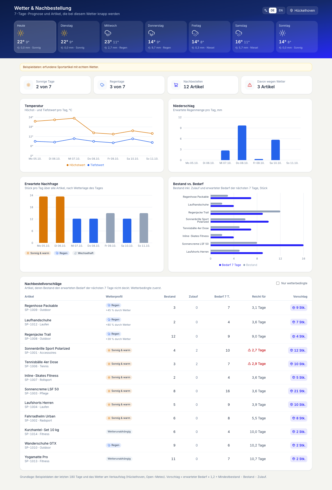
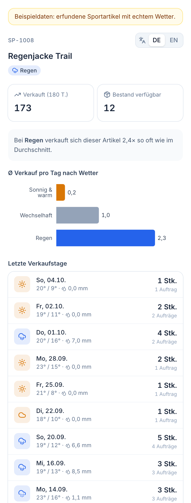

# Wetter-Sport

JTL Cloud App für Sportgeschäfte, deren Verkäufe vom Wetter abhängen. Sie zeigt zu jedem Artikel, bei welchem Wetter er sich verkauft hat, und schlägt anhand der 7-Tage-Prognose vor, was nachbestellt werden sollte.



## Was die App zeigt

**Seitenleiste "Verkäufe & Wetter"** (Artikelansicht im ERP, Route `/item-weather`)

- Die letzten Verkaufstage des gewählten Artikels, jeweils mit Wetter, Temperatur und Regenmenge an diesem Tag.
- Ø Verkauf pro Tag je Wetterlage als Diagramm.
- Wetterprofil des Artikels, z. B. "Bei Regen verkauft sich dieser Artikel 2,4× so oft wie im Durchschnitt".



**Menüeintrag "Wetter & Nachbestellung"** (Route `/weather-dashboard`)

- 7-Tage-Prognose für den Standort des Geschäfts (im Dashboard änderbar, Standard Hückelhoven).
- Diagramme: Temperatur, Niederschlag, erwartete Nachfrage pro Tag, Bestand gegen Bedarf.
- Nachbestellvorschläge. Artikel, die wegen des vorhergesagten Wetters knapp werden, stehen oben.

Beide Ansichten gibt es auf Deutsch und Englisch (Umschalter oben rechts).

## Berechnung

| Wert | Regel |
| --- | --- |
| Wetterlage pro Tag | Regen ab 1 mm, kalt unter 8 °C, sonnig ab 18 °C (oder ab 14 °C mit 6 h Sonne), sonst wechselhaft |
| Wetterprofil | Ein Artikel ist z. B. ein Schönwetter-Artikel, wenn er bei Sonne mindestens 1,3× so viel verkauft wie im Schnitt |
| Erwarteter Bedarf | Ø Verkauf je Wetterlage, summiert über die 7 Prognosetage |
| Nachbestellmenge | Bedarf × 1,2 + Mindestbestand - Bestand - Zulauf |

Datenquellen: Aufträge der letzten 180 Tage über die ERP GraphQL API (10 Minuten pro Mandant zwischengespeichert), Wetter von [Open-Meteo](https://open-meteo.com) (Archiv und Prognose, ohne API-Key).

## Lokal starten

```bash
npm install
npm run register   # einmalig: App bei JTL registrieren, schreibt die .env-Dateien
npm run dev        # Frontend :3004, Backend :3005
```

Ohne JTL-Login laufen beide Ansichten mit Beispieldaten (erfundene Sportartikel, echtes Wetter):

- http://localhost:3004/weather-dashboard
- http://localhost:3004/item-weather?itemId=demo-1

Im ERP lässt sich über den Hinweis oben ebenfalls auf Beispieldaten umschalten, falls der Mandant kaum Verkäufe hat.

## Entstehung

Gebaut mit Claude Code in der Session "Die JTL Cloud kann das nicht? Dann bau es dir einfach selbst." am Haupttag der JTL Connect 2026. Die Prompts und Antworten stehen in [docs/prompt-history.md](docs/prompt-history.md).
